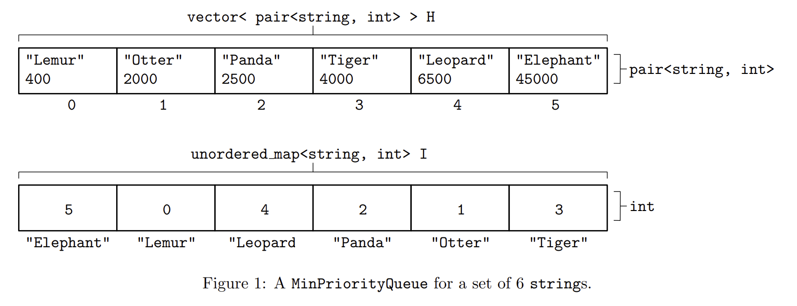

# CSCI 3333 Homework PQ: Min Priority Queue
---
## 1 Introduction
The goal of this homework is to build a min priority queue that can be used as part of the solution to a
later homework, [hwMZ2](https://faculty.utrgv.edu/robert.schweller/CS3333/hwMZ2.pdf). This homework is unlike previous homeworks in that you’ll implement a template
class. If you recall, a template class is both declared and implemented in a common header file, so the
implementation will be done by modify a provided header file.[^1]

[^1]: This enables adding other methods and instance variables, though including additional libraries is forbidden.
## 2 Instructions
The following files have been given to you:
1. A C++ header file ([minpriorityqueue.h](https://faculty.utrgv.edu/robert.schweller/CS3333/hwPQ/main.cpp)) incorrectly implementing the MinPriorityQueue template
class.
2. A C++ source file ([main.cpp]()) containing a main function with tests.
Correct the implementation of the template class in minpriorityqueue.h so that the provided files compile
into a program that runs with no failed tests. Submit the header file minpriorityqueue.h.
## 3 Submission and Grading
Submit the aforementioned source file(s) via Blackboard as attached file(s). In the case of multiple submissions, the last submission before the deadline is graded.
For grading, each submission is compiled with the provided files and run. Submissions that do not run
to completion (i.e. fail to print “Assignment complete.”) receive no credit. Submissions that take an
unreasonable amount of time (e.g. more than a minute or so) to run and do not meet the asymptotic
efficiency requirements receive no credit. All other submissions receive full credit.
See the course late work policy for information about receiving partial credit for late submissions.
